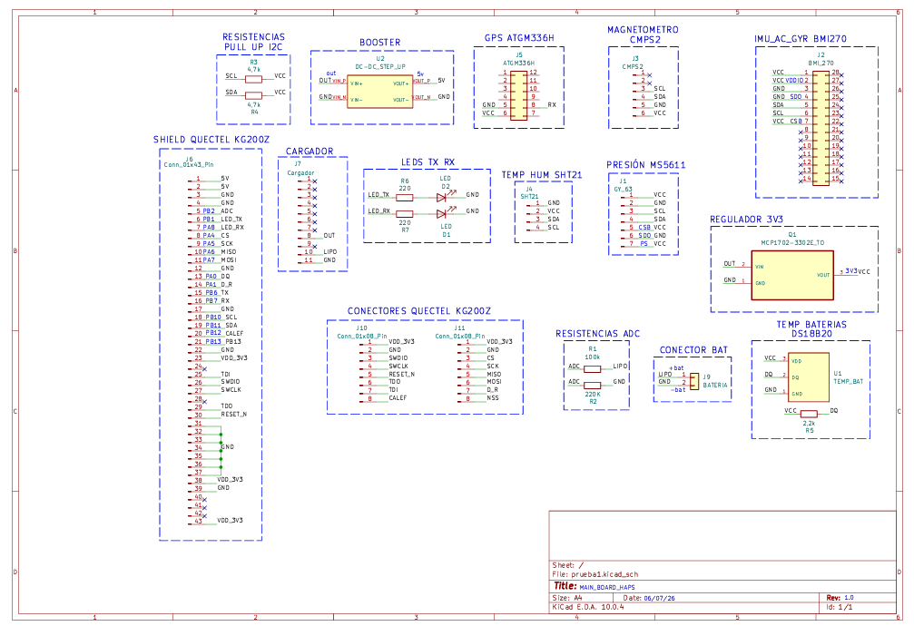
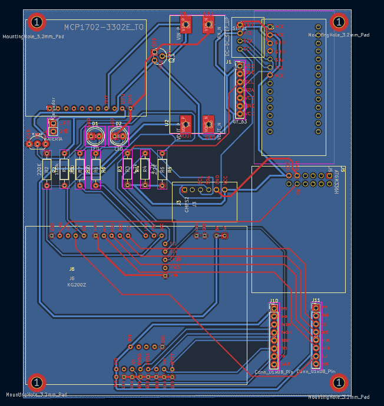
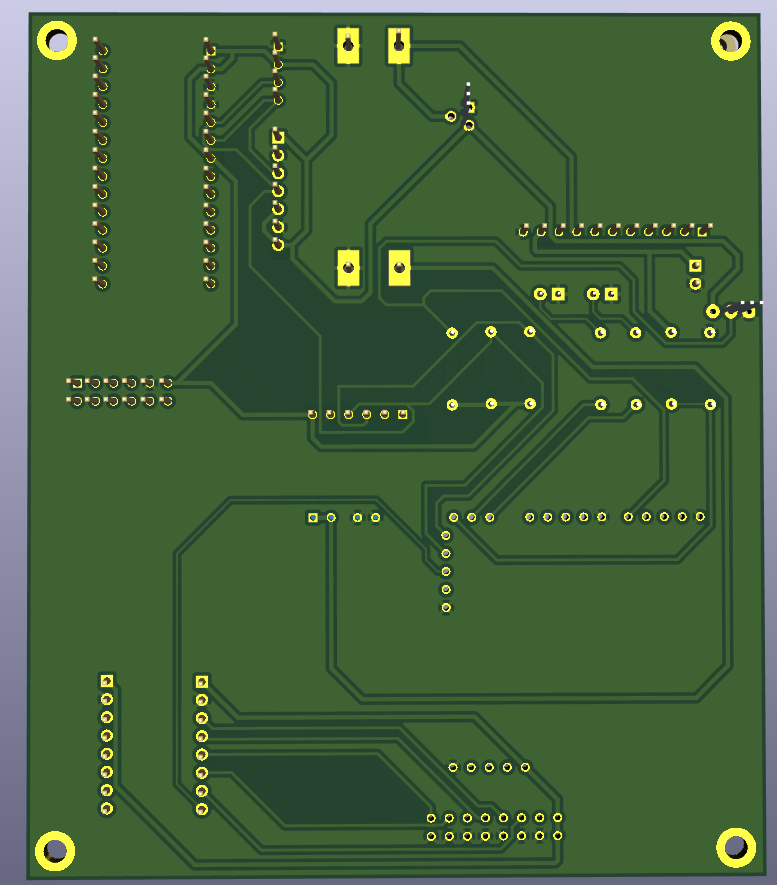

# main_board_habp

Placa principal (main board) del sistema de adquisición de datos y telemetría para un **globo meteorológico de alta altitud (HABP – High Altitude Balloon Project)**, diseñada en KiCad. Este repositorio contiene el esquemático, el PCB y los archivos de proyecto de la placa que integra el microcontrolador, la red de sensores, el módulo GPS, el enlace LoRa y el sistema de gestión de energía del nodo.

Este proyecto forma parte de una pasantía en CEGA Electrónica, desarrollada por **Franco Santander** y **Lisandro Elmelaj**.

## Descripción general

El objetivo del sistema es recolectar variables físicas del entorno y datos de posicionamiento durante el vuelo de un globo de alta altitud, empaquetarlos de forma eficiente y transmitirlos por radiofrecuencia mediante LoRa, todo en un nodo autónomo capaz de operar en condiciones extremas (hasta ~30 km de altitud, presión menor a 1 kPa y temperaturas de hasta -70 °C).

El sistema completo se organiza en cuatro subsistemas funcionales:

1. Red de sensores
2. Procesamiento de datos y empaquetado
3. Gestión de energía
4. Enlace de comunicaciones (LoRa)

## Hardware

### Microcontrolador

El núcleo del sistema es un microcontrolador de la familia **STM32** (STM32WL55C), montado sobre el módulo **Quectel KG200Z**, que integra de fábrica la etapa de radiofrecuencia LoRa.

### Red de sensores (bus I2C)

Todos los sensores se comunican por I2C (interfaz `I2C3`):

- **BMI270** – IMU de 6 grados de libertad (acelerómetro + giroscopio) con sensor de temperatura interno.
- **SHT21** – Temperatura y humedad ambiente.
- **MS5611** – Presión atmosférica absoluta y temperatura (cálculo de altitud redundante).
- **CMPS2** – Magnetómetro, orientación y azimut respecto al norte magnético.

### Posicionamiento y depuración (UART)

- **ATGM336H (GPS)** vía `USART1`, con recepción por interrupciones sobre un ring buffer de 512 bytes y parsing de tramas NMEA (`GGA`, `VTG`).
- **Consola de telemetría** vía `USART2`, usada como puerto de depuración.

### Gestión de energía

- Celda de litio **18650 en configuración 1S** (3.0 V–4.2 V).
- **BMS** basado en DW01A + FS8205A (protección de sobretensión, subtensión y sobrecorriente).
- Cargador solar **BQ24074** (Texas Instruments), con gestión dinámica de potencia (DPM) entre panel solar y batería.
- Medición de batería por ADC (`PB1`) con divisor resistivo, sobremuestreo y filtro EMA para estimar el estado de carga (SoC).
- Sistema de calefacción para mantener la celda por encima de 0 °C (corte de encendido/apagado en 10 °C / 22 °C).

## Protocolo de comunicaciones: empaquetado TLVPara minimizar el tiempo en el aire (*time-on-air*) del enlace LoRa, el firmware arma un payload binario bajo el esquema **TLV (Type-Length-Value)** en lugar de texto plano, incluyendo únicamente las variables válidas en cada transmisión (por ejemplo, se omiten las coordenadas si el GPS todavía no tiene *fix*).

| Tag | Descripción | Longitud | Formato |
|-----|-------------|----------|---------|
| `0x01` | Hora UTC (GPS) | 3 bytes | Horas, minutos, segundos |
| `0x02` | Coordenadas GPS | 8 bytes | Latitud y longitud (`int32_t`) |
| `0x03` | Altitud GPS | 2 bytes | Metros sobre el nivel del mar |
| `0x04` | Velocidad de desplazamiento | 2 bytes | km/h (×100) |
| `0x05` | Aceleración (IMU) | 6 bytes | Ejes X, Y, Z (`int16_t`) |
| `0x06` | Giroscopio (IMU) | 6 bytes | Ejes X, Y, Z (`int16_t`) |
| `0x07` | Temperatura SHT21 | 2 bytes | °C (×100) |
| `0x08` | Humedad SHT21 | 2 bytes | % (×100) |
| `0x09` | Presión atmosférica (MS5611) | 4 bytes | mbar (×100, `uint32_t`) |
| `0x0B` | Voltaje de batería | 2 bytes | mV (`uint16_t`) |
| `0x0C` | Estado de carga (SoC) | 1 byte | % (0–100) |
| `0x0D` | Azimut (magnetómetro) | 2 bytes | Grados (×100) |
| `0x0E` | Temperatura de batería (DS18B20) | 2 bytes | °C (×100) |
| `0x0F` | Estado del calefactor | 1 byte | Booleano (1 = ON, 0 = OFF) |

El enlace opera en la banda ISM de 915 MHz (configurable a 917.3 MHz), con BW = 125 kHz y SF7 por defecto, gestionado mediante una máquina de estados no bloqueante sobre el secuenciador `UTIL_SEQ`, con ventana de escucha de ACK de 3000 ms tras cada transmisión.

## Diseño de PCB

*Esquemático completo del nodo sensor, capturado de forma jerárquica en KiCad.*

El diseño se realizó en **KiCad**, de forma modular (para poder acoplar directamente los sensores utilizados durante el desarrollo, dejando la versión SMD final para la etapa posterior de integración).

- **2 capas**: capa superior para ruteo de señales y componentes, capa inferior con plano de masa (GND) continuo, plano de alimentación (VCC) y bus I2C.
- Distribución de componentes pensada para minimizar interferencia electromagnética (EMI): el módulo de energía (MPPT) y los conectores de batería en un extremo, el transceptor LoRa/GPS alejado de fuentes de ruido de conmutación.
- Copper pour de GND en las capas exteriores y pistas anchas en la zona del conversor DC-DC (BQ25570) para soportar picos de corriente.
- Orificios de montaje (*mounting holes*) para fijación mecánica al chasis de la sonda.

| Top Layer | Bottom Layer | Top + Bottom |
|:---:|:---:|:---:|
|  |  |  |

### Modelado 3D

| Vista frontal | Vista trasera |
|:---:|:---:|
|  |  |

### Archivos del repositorio

- `prueba1.kicad_pro` / `prueba1.kicad_sch` / `prueba1.kicad_pcb` — proyecto, esquemático y PCB de KiCad.
- `prueba1.kicad_prl` — configuración de proyecto.
- `esquemático.pdf` — esquemático completo exportado.
- `fp-lib-table` / `sym-lib-table` — tablas de librerías de footprints y símbolos.
- `madeinhome.pretty/` — librería de footprints propia.
- `Imagenes/` — renders y capturas del esquemático, capas y modelado 3D de la placa.

## Repositorios relacionados

Este repositorio contiene únicamente el diseño de hardware (PCB). El firmware del proyecto está dividido en repositorios separados:

- **[shield_board_kg200z](https://github.com/francojsantander22-afk/shield_board_kg200z)** — Placa/shield de acople para el módulo Quectel KG200Z.
- **[sensores](https://github.com/francojsantander22-afk/sensores)** — Drivers e integración de la red de sensores (BMI270, SHT21, MS5611, CMPS2).
- **[lora_tx_sensores](https://github.com/francojsantander22-afk/lora_tx_sensores)** — Firmware del nodo transmisor: adquisición de sensores, empaquetado TLV y envío por LoRa.
- **[lora_rx_deco](https://github.com/francojsantander22-afk/lora_rx_deco)** — Firmware del receptor en tierra: recepción del enlace LoRa y decodificación del protocolo TLV.

## Autores

- Franco Santander
- Lisandro Elmelaj

Proyecto desarrollado en el marco de una pasantía en **CEGA Electrónica**.
